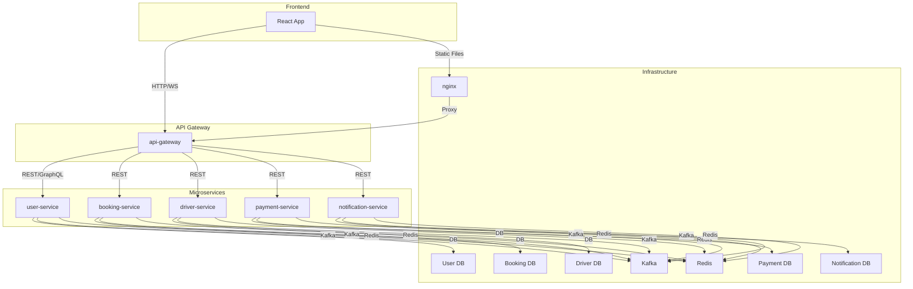

# System Architecture

## Overview

This system is designed as a microservices-based architecture for a ride-hailing platform. It consists of:
- **Frontend**: React app for users and drivers.
- **API Gateway**: Central entry point, routing requests to backend services.
- **Microservices**: User, Booking, Driver, Payment, and Notification services, each with its own database and cache.
- **Infrastructure**: NGINX for static file serving and reverse proxy, Kafka for async messaging, Redis for caching, and individual databases for each service.

All services are containerized with Docker and orchestrated via Docker Compose (dev) or Kubernetes (prod). 